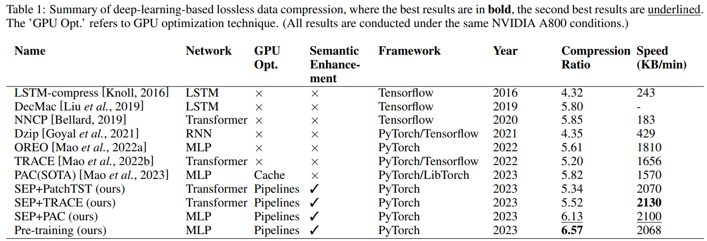

# CSIformer

This is an official implementation for the paper: **SEP: A General Lossless Compression Framework with Semantics Enhancement and Multi-Stream Pipelines**.
SEP is a deep-learning-based lossless compression framework, designed to improve both the compression speed and compression ratio. SEP framework stands out by transforming existing single-byte symbols into sub-sequence level patches, enabling a more efficient capture of compressed sequence correlations. At the same time, SEP uses GPU memory optimization and pipelines.


# Key Designs
🌟 **Semantics enhancement block**: We propose a series of novel approaches to capture complex semantic information of adjacent byte sequences, which achieve higher compression ratios across diverse data types.

🌟 **Multi-stream pipelines**: We propose multi-stream pipeline mechanism for parallel compression. By hiding disk I/O and CPU-GPU data transfer, such as Host to Device(H2D) and Device to Host(D2H), we try to maximize the hardware utilization for reducing the compression time. 

🌟 **GPU Memory Optimization**: We propose an innovative approach to reuse GPU memory across streams, while GPU memory is isolated for PyTorch streams. This approach achieves an average decrease of 36\% GPU memory usage in multi-stream environments.

🌟 **State-of-the-art(SOTA) compression performance**: We conduct experiments to prove that our framework can increase the compression ratio of the networks by an average of 5\% and increase the compression speed by 30\%. Our pre-training models can further improve the  average compression ratio to 7.6\%.

## Overall Architecture

The SEP framework with the workflow detail of the Semantics Enhancement Block (SEB). All types of uncompressed files are firstly converted to byte streams and sent to the SEB. The SEB then extracts the features of the byte stream and turns it into fusion patch with adaptive stride. By feeding the enhanced matrix $\mathbf{Z}$ into alternative networks, the probability distribution of the next byte is predicted. Finally, the byte stream with probability distribution is compressed by the arithmetic coder. The entire compression process is accelerated by the Multi-Stream Pipelines method.

<p align="center">

</p>

<p align="center">

</p>


## Usage

1. Install Pytorch and necessary dependencies.

```
pip install -r requirements.txt
```

2. Download data. You can download all the datasets. Create a seperate folder ./data and put all the files in the directory.

3. Train and evaluate the model. All the scripts are in the directory ./SEP/Model/run.sh. For example, if you want to get the TRACE results for Enwik9 dataset, just run the following command, and you can open nohup.log to see the results once the training is done.
```
nohup ./run.sh &
tail -f nohup.log
```

## Main Results

We use Compression Speed and Compression Ratio as model evaluation metrics. Overall, CSIformer model achieves the best performance in the vast majority of cases.

<p align="center">

</p>


## Model Comparision

To improve both compression ratio and compression speed of deep-learning-based lossless compressors, the existing research focus on different networks. The recent deep-learning-based lossless compressors are mainly built based on PyTorch. In Table, we present the various characteristics of several deep-learning-based compressors. Compressors like tensorflow-compress and DecMac use Long Short-Term Memory(LSTM) to capture long-term dependencies within the input data stream.  Through the studies on different networks, the latest research suggests that the mechanisms of transformer and multi-layer perception (MLP) can achieve even more accurate estimation and also higher compression speed compared to other deep-learning-based lossless compressors. NNCP, TRACE, OREO and PAC are the typical compressors which use transformer or MLP. The most deep-learning-based lossless compressors train their networks with GPU to speed up the compression process. PAC reduces the traffic of CPU-GPU data transfer using software cache in GPU memory, which helps PAC compressing faster. The work on GPU memory optimization is mainly focused on offloading, recomputation and defragmentation, with no attention paid to multi-stream reusage.

<p align="center">

</p>


## Acknowledgement

We appreciate the following works for their valuable code and data for lossless compression:


https://github.com/ts-kim/RevIN

